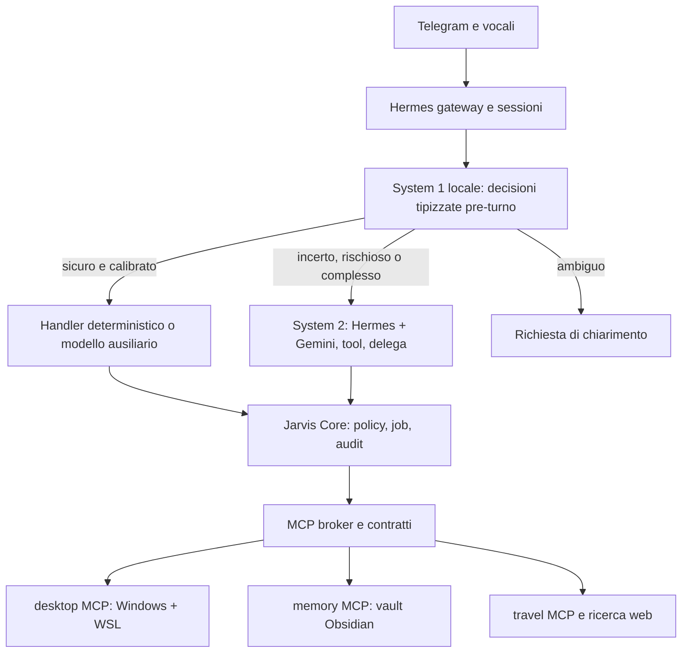

# JARVIS V1 — Specifica di prodotto e architettura

**Versione documento:** 1.2 · **Data:** 26 settembre 2026 · **Precedente:** 1.1 del 23 settembre 2026

**Stato:** specifica in vigore e backlog implementativo. Il repository contiene già un server MCP stdio con capacità locali e test automatici; solo alcune capacità sono state validate sul PC reale e via Telegram (vedi «Aggiornamento operativo» in fondo). **Destinatario:** sviluppo locale con le skill di Matt Pocock.

Le sezioni 1–12 definiscono prodotto e architettura; le appendici A–I rendono espliciti contratti, ticket, verifiche, passaggio all’agente di sviluppo e System 1. Le scelte aggiuntive sono proposte tecniche, non preferenze attribuite all’utente.

**Novità della 1.2:** Jev/TypeSafe non è ottenibile (registrazioni chiuse): il routing adotta un’architettura System 1/System 2 con decisore locale tipizzato e calibrato (sezione 7, D13, appendice I). Le prove di sicurezza devono essere record lato server, mai flag del chiamante (D14). Aggiunti AT13–AT15.

## 1. Problema e obiettivo

Da Telegram, l'utente vuole affidare a un unico assistente attività sul PC Windows/WSL, progetti software, ricerca web e pianificazione viaggi. Vuole risultati verificabili, memoria adattiva e poche conferme: solo per azioni con effetti esterni, privilegi elevati o distruzione di dati. La V1 è semi-autonoma; la proattività è successiva.

**Risultato V1:** un messaggio o vocale Telegram autorizzato avvia un lavoro, produce aggiornamenti e un esito con fonti/evidenze, può leggere e modificare progetti con recupero delle modifiche, e richiede una conferma specifica prima delle operazioni protette. Un solo JARVIS visibile all'utente.

## 2. Perimetro e priorità

| Priorità | Dominio | Capacità V1 verificabile |
|---|---|---|
| 1 | PC remoto | Stato Windows/WSL, processi e spazio, lettura log, esecuzione di comandi consentiti, modifica file con checkpoint, gestione di lavori lunghi. |
| 2 | Sviluppo | Stato Git, ricerca nel repo, modifiche, test/build, commit, Docker e DB; push solo dopo conferma. |
| 3 | Travel | Ricerca di voli/date flessibili da un provider realmente integrato, filtri, ranking Pareto, tre alternative motivate e dati con timestamp. |
| 4 | Ricerca web | Ricerca e sintesi con link alle fonti e separazione tra dati e inferenze. |
| 5 | Agenda/email/reminder | Primo connettore selezionato in discovery; lettura e bozze, invio/creazione esterna con conferma. Se mancano credenziali o API, la milestone Core espone la funzione come non configurata; la V1 completa richiede un connettore operativo (appendice A). |

**Interfacce:** Telegram testo e messaggi vocali; Hermes CLI per amministrazione. Nessuna dashboard V1. Wake word, conversazione continua, notifiche spontanee, acquisto automatico, agenti specialisti e nodo laptop/VPS operativo sono fuori perimetro.

## 3. Storie utente e criteri di accettazione

1. Come proprietario, invio «quanto spazio libero ho?» e ricevo valori, macchina e ora, senza passaggi manuali.
2. Come proprietario, invio un vocale sullo stato di Fantavega e ricevo trascrizione, analisi dei log e conclusione con evidenze.
3. Come proprietario, chiedo di risolvere un bug in WSL: JARVIS identifica il repo, crea un checkpoint, modifica i file, esegue le verifiche pertinenti e comunica diff ed esito.
4. Come proprietario, autorizzo il commit automatico; il push resta in attesa di una conferma legata a repository, branch e commit specifici.
5. Come proprietario, posso annullare un'operazione protetta e verificare che non sia stata eseguita.
6. Come proprietario, cerco voli per Bali con date flessibili: ricevo offerte reali, 3 scelte confrontabili, prezzo/valuta, durata/scali, provider e istante di consultazione; prezzi vecchi sono segnalati.
7. Come proprietario, correggo una preferenza nell'Obsidian vault e la ricerca successiva usa quella nuova versione; un'inferenza automatica non scavalca una regola esplicita.
8. Come proprietario, cerco informazioni online e posso aprire le fonti usate.
9. Come proprietario, dopo riavvio di Hermes o di un MCP server, posso continuare a usare il bot senza perdere preferenze e audit delle azioni.
10. Come proprietario, se un provider LLM, il System 1 locale o un provider voli non risponde, ricevo un errore circoscritto o un fallback dichiarato, mai una prenotazione, un risultato inventato o una scrittura non verificata.
11. Come proprietario, per una richiesta lunga ricevo subito un riscontro breve su cosa sta per succedere, e l’esito verificato arriva appena pronto, senza dover riscrivere.

**Accettazione end-to-end:** dimostrare le storie su PC principale e telefono; simulare un prompt injection dentro pagina web/log/nota che tenta un push o un invio non autorizzato; verificare che la policy blocchi l'effetto e chieda conferma solo sul piano d'azione legittimo.

## 4. Architettura

**Confini:** Hermes gestisce Telegram, sessione, tool calling e modelli. Il System 1 fornisce decisioni tipizzate e confidenze calibrate, mai autorizzazioni. Jarvis Core applica policy, costruisce il contesto, decide i flussi e conserva audit. Gli MCP espongono capacità per dominio ed eseguono l’enforcement finale. In V1 possono essere processi locali `stdio`; i nomi e i contratti includono `device_id` per aggiungere in seguito server remoti autenticati. Un plugin Hermes minimale per l’hook pre-turno è una *ipotesi d'integrazione* da provare con uno spike, ed è l’unico punto in cui un fast path può davvero evitare il modello principale: se l'hook non può intercettare le richieste, le policy restano dentro i tool MCP, il System 1 si limita a iniettare contesto e scegliere il modello del turno, e Jarvis Core diventa un set di tool orchestratori, senza aggirare Hermes.

**Distribuzione da validare:** Hermes su Windows per computer use grafico; MCP di sviluppo in Debian WSL2 per Git, Docker e filesystem Linux. Uno spike iniziale verifica installazione, gateway Telegram, percorso sicuro Windows→WSL e persistenza dei processi. Non assumere che un'installazione Windows garantisca da sola computer use o checkpoint automatici per modifiche fatte dai nostri MCP.

**Stack indicativo:** Python 3.12, uv, Pydantic, SDK MCP Python, SQLite per audit/cache e provider esterni dietro adapter. Runtime locale del System 1 con output vincolato (grammatica/JSON schema) e accesso ai logprob, ad esempio llama.cpp o Ollama, scelto dal benchmark. FastAPI soltanto se serve un endpoint HTTP remoto; la V1 locale usa stdio.

## 5. Contratti MCP

Ogni tool accetta input validato, timeout, `request_id` e, per operazioni su dispositivo, `device_id`; risponde con `ok`, dati tipizzati o errore `{code, message, retryable}`, provenienza e `observed_at`. Le scritture ricevono `idempotency_key`; il Core registra identità Telegram, target, risorse, esito e digest dei dati sensibili. Output esterni (web, log, note) sono dati non fidati e non istruzioni.

| Server | Tool iniziali | Vincolo |
|---|---|---|
| `desktop-mcp` | `device_status`, `disk_usage`, `read_logs`, `read_file`, `list_processes`, `run_command`, `write_file`, `restore_checkpoint` | Root/percorso e comando per capacità; Windows e WSL espliciti. |
| `dev-mcp` | `repo_status`, `search_repo`, `run_checks`, `git_diff`, `git_commit`, `git_push`, `docker_status`, `db_query_readonly` | Repo allowlist; SQL read-only separato da mutazioni. |
| `memory-mcp` | `get_profile`, `search_notes`, `read_note`, `propose_memory`, `write_note`, `update_preference` | Scope vault e note; conflitti/precedenza dichiarati. |
| `travel-mcp` | `search_airports`, `search_flights`, `optimize_itineraries`, `get_offer_details` | Provider reale, limiti di quota, cache, freschezza. |
| `research-mcp` | `web_search`, `fetch_page` | URL, fonte, timestamp. |
| `personal-mcp` | `calendar_search`, `draft_message`, `create_reminder` | Da attivare solo dopo scelta account/provider. |

Questi sono **contratti previsti**; l’implementazione attuale li riunisce in un unico server `jarvis_hermes` (vedi aggiornamento operativo). Il terminale deve supportare manutenzione avanzata e comandi nuovi senza una lista rigida di singoli comandi. Ogni esecuzione è però valutata per effetti e contesto: letture automatiche, scritture reversibili con checkpoint, effetti protetti con conferma. Se una composizione shell non è analizzabile, si richiede la conferma del comando esatto. La classificazione non si basa soltanto sul nome dell’eseguibile. Catalogo tool filtrato per dominio, ma la sicurezza risiede nei server e nella policy, non nel solo filtro visivo dei tool. Le annotazioni MCP (`destructiveHint` e simili) sono informative per il client e non sostituiscono l’enforcement nel server.

## 6. Autorizzazione e difesa

| Azione | Comportamento V1 |
|---|---|
| Letture, ricerca, Git status | Automatico per identità e risorse ammesse. |
| Modifiche file | Automatiche con snapshot/diff e ripristino testato; esclusi segreti, file di sistema e percorsi non consentiti. La scrittura è accettata solo se riferisce un checkpoint registrato per lo stesso job, progetto e percorso. |
| Test, build, commit | Automatici su repo consentiti, con output e hash commit. Il commit riferisce l’ID di un run di verifica persistito e riuscito sugli stessi file. Restart Docker ammesso per servizi esplicitamente consentiti. |
| Push, email inviata, evento esterno | Conferma Telegram specifica, a scadenza, monouso, associata a parametri e contenuto. |
| `sudo`, cambi sistema, acquisti | Conferma esplicita con riepilogo degli effetti; acquisti V1 solo handoff/manuale. |
| `rm -rf`, drop DB e altre distruzioni | Conferma forte e scope ristretto; bloccare pattern non analizzabili. |

L'identità è l'ID Telegram dell'utente, non nome/handle; allowlist di chat e account. Il token bot e le API key sono in secret store/variabili d'ambiente, mai nel vault, negli URL o nei log. L'esecutore rivalida la conferma immediatamente prima dell'effetto; un testo in pagina web, file, risposta LLM o decisione del System 1 non può concederla. Audit append-only locale con redazione dei segreti e rotazione. La conferma forte resta utilizzabile da telefono: riepilogo completo e digitazione di una challenge associata all’azione, oltre al pulsante di conferma. Questo riduce errori accidentali, ma non costituisce un secondo fattore indipendente. Se un’operazione richiede presenza fisica o un consenso OS non gestibile da remoto, dichiararla bloccata; non simulare il consenso. Allowlist vuote (remote, branch, root) significano «nulla consentito», mai «tutto consentito».

## 7. Routing, modelli e indisponibilità: architettura System 1 / System 2

**Premessa.** L’account TypeSafe/Jev non è ottenibile (nuove registrazioni chiuse al 26 settembre 2026) e l’API reale di Jev non corrisponde al client ipotizzato nel router attuale. Jev non è quindi una dipendenza V1. Si adotta la teoria System 1/System 2 replicandone i principi utili: decisioni piccole e tipizzate, output vincolato, confidenza calibrata, controllo di flusso nel codice.

**System 1 (decisore rapido).** Modello locale piccolo sulla RTX 5070 che non genera prosa, non chiama tool e non concede permessi. Riceve uno `state` compatto e già filtrato (messaggio corrente, digest preferenze, ultimo job, catalogo skill ridotto) e un insieme di domande indipendenti valutate in una sola chiamata:

- `Choice`: un’etichetta da un insieme chiuso (intento, handler, skill suggerita);
- `Score`: un valore su una rubrica ordinata (complessità 1–5, rischio 1–5);
- `Binary`: una probabilità 0–1 (serve chiarimento? effetto esterno? dati privati?).

L’output è vincolato da grammatica o JSON schema. La confidenza deriva dai logprob dei token delle etichette, non da un numero dichiarato dal modello. Output non valido, `NaN`, fuori da [0,1] o oltre il budget di latenza (default proposto 300 ms) causa escalation. Contratto completo nell’appendice I.

**System 2 (ragionatore).** Hermes con il modello principale (`gemini-3.8-flash`, configurabile, override esplicito consentito senza cambiare policy), tool MCP e delega/background per lavori lunghi.

**Politica di instradamento, decisa dal codice e non dal modello:**

1. regole deterministiche note;
2. System 1: se l’azione è in una classe sicura e la confidenza supera la soglia calibrata per quella classe, handler deterministico diretto o modello ausiliario economico;
3. se rischio alto, effetto esterno probabile, complessità alta o confidenza sotto soglia: System 2;
4. se la richiesta è ambigua o le domande sono in conflitto: chiarimento.

Le soglie sono per classe di azione (basse per letture di stato, altissime o assenti per effetti protetti). Nessuna decisione del System 1 sostituisce policy, checkpoint o conferme.

**Punto di integrazione.** Il System 1 deve girare prima del turno del modello principale: plugin/hook pre-turno Hermes o dispatcher davanti al gateway. Un tool MCP `route_request` invocato dal modello principale non è un fast path, perché il modello lento ha già elaborato il turno; resta utile solo come diagnostica e per i test del dataset. Se lo spike dimostra che Hermes non espone un hook adeguato, il System 1 si limita a iniettare contesto (skill suggerita, flag di rischio) e a scegliere il modello del turno, e la promessa di bypass viene ritirata.

**Talker–Reasoner per Telegram e vocali.** Quando una richiesta va al System 2 e supera il budget di risposta, il talker invia subito un riscontro breve (obiettivo ≤ 3 s) con ciò che verrà fatto; il lavoro prosegue come job; il risultato aggiorna lo stesso messaggio o arriva in un messaggio successivo. Il riscontro non dichiara esiti non ancora verificati.

**Modelli ausiliari Hermes.** Compressione del contesto, titoli di sessione, review della memoria ed estrazione web usano un modello economico o locale configurato negli slot ausiliari di Hermes, senza cambiare policy.

**TypeSafe/Jev.** Resta possibile come adapter opzionale dietro la stessa interfaccia (`state` + domande tipizzate), attivabile se in futuro l’accesso sarà disponibile; non modifica soglie o permessi senza nuova calibrazione sullo stesso dataset.

**Indisponibilità.** System 1 assente, lento o non valido: System 2 con permessi invariati. Modello locale per riepiloghi: usato solo per dati non sensibili o local-only e solo se la qualità misurata è sufficiente; non è richiesto il funzionamento offline. Nessun fallback può abbassare i permessi. Non promettere risparmio o assenza di chiamate LLM finché il flusso Hermes reale non è misurato secondo l’appendice I.

## 8. Memoria Obsidian

Obsidian vault come **fonte lunga modificabile dall'utente**: `System`, `Projects`, `Travel`, `People`, `Knowledge`, `Decisions`, `Daily`, `Archive`. `preferences.yaml` contiene impostazioni operative esplicite; il vault contiene note e preferenze umane, con frontmatter `type`, `domain`, `source: explicit|inferred`, `confidence`, `updated_at`. Precedenza: istruzione corrente dell'utente > preferenza esplicita aggiornata > regola generale > inferenza. In caso di contraddizione, mostrare conflitto e chiedere chiarimento prima dell'azione dipendente.

Hermes `USER.md` e `MEMORY.md` restano sommari di contesto, non copie integrali del vault; lo storico delle sessioni è evidenza conversazionale. La prima integrazione legge/scrive Markdown direttamente sotto un path autorizzato con ricerca testuale locale; plugin Obsidian REST/MCP è opzionale e non richiesto per il funzionamento quando l'app è chiusa. Memorie apprese sono proposte con fonte, motivo e possibilità di rimozione; nessuna deduzione isolata diventa vincolo rigido. Il digest compatto delle preferenze usato nello `state` del System 1 è derivato e ricostruibile, mai una seconda fonte autorevole.

## 9. Travel optimizer

Il provider deve offrire dati effettivi su tratte e date richieste: una query API raramente copre **tutte** le combinazioni aeroporto/data, quindi il pianificatore prima determina copertura, numero di richieste e quota. Raggruppa le richieste quando il provider lo permette, mantiene cache di risposte grezze con TTL e scadenza, deduplica, normalizza valuta/bagagli/tasse e applica vincoli (durata, scali, self-transfer, coincidenze). Il fronte di Pareto usa costo totale, durata e rischio; un punteggio secondario applica preferenze. L'LLM spiega le tre alternative senza inventare disponibilità. Prima di prenotare occorre una nuova verifica prezzo/disponibilità presso il venditore.

**Gate provider:** prova due provider documentati con credenziali proprie, limiti e condizioni d'uso, copertura Bali e date flessibili; misura chiamate per una ricerca realistica. Se nessuno dà offerte reali adeguate nel free tier, presentare link di ricerca e limitare l'ottimizzatore a dati verificabili, esplicitando la copertura. Non fare scraping contrario ai termini.

## 10. Qualità e verifica

Testare comportamenti ai confini: richiesta Telegram→MCP→risposta; autorizzazione negata/scaduta; doppia conferma non riutilizzabile; ripristino file; scrittura senza checkpoint valido; commit senza run di verifica persistito; annullamento con processo reale; errore Windows↔WSL; vault modificato manualmente; cache voli scaduta; prezzi incompleti; prompt injection in log, pagina e nota; output malformati del System 1. Fixture di offerte per Pareto e test del provider con quota minima. Test di integrazione su macchina reale per gateway, audio, path WSL e restart. Obiettivo iniziale: zero esecuzioni protette senza token valido, zero fast path errati su azioni protette, nessuna modifica non recuperabile nelle demo, ogni risposta travel tracciabile a offerte e timestamp. Misurare latenza e costo prima di fissare SLA. Aggiungere in CI lint, type check e audit delle dipendenze.

## 11. Sequenza di realizzazione e dipendenze

| Fase | Deliverable e prova | Dipende da | Lavoro parallelo possibile |
|---|---|---|---|
| 0 | Repo, lessico `CONTEXT.md`, ADR, setup skill, spike Hermes/Telegram/Windows/WSL/MCP, spike hook pre-turno Hermes, selezione provider voli e account | Nessuna | Ricerca provider e prototipo memoria |
| 1 | Contratti Pydantic, policy, identità, audit, errori, test del confine unico Core→MCP; invarianti D14 | Gate fase 0 | Fixture travel, struttura vault, raccolta dataset di routing |
| 2 | Desktop/dev MCP e primi flussi Telegram con checkpoint, commit, conferma push | Fase 1 | Memory MCP |
| 3 | Vault, preferenze; System 1 locale calibrato con fallback su System 2; telemetria di routing | Fase 1 | Ricerca web e travel provider |
| 4 | Travel optimizer con offerte reali; ricerca web; funzione personal limitata alle credenziali disponibili; talker con riscontro immediato | Fasi 1 e 3 | Miglioramenti UX Telegram |
| 5 | Test integrati, sicurezza, recupero, costi, manuale installazione/operazione e demo delle storie | Fasi 2–4 | Documentazione progressiva |

**Uso delle skill Matt Pocock:** installare nel repo una sola modalità (`npx skills@latest add mattpocock/skills` per Codex, oppure plugin Claude Code); eseguire `setup-matt-pocock-skills` per scegliere tracker e documentazione. La presente specifica è input per la pianificazione e per `to-tickets`, che produce ticket verticali con dipendenze esplicite; verificare i nomi delle altre skill nella versione effettivamente installata; usare `prototype` sugli spike incerti, `tdd` per policy/contratti, `review` prima del completamento. `to-spec` può convertire la spec nel formato del tracker dopo setup, evitando di crearne una seconda incoerente.

## 12. Decisioni aperte, con default V1

1. **Repo e tracker:** deciso — `nuno80/Jarvis-hermes` con GitHub Issues (vedi aggiornamento operativo).
2. **Provider travel:** resta un gate della fase 0; nessuna API dichiarata gratuita/esaustiva senza prova.
3. **Calendar/email:** scegliere servizi e autorizzazioni nella fase 0; capacità base subordinata all'accesso.
4. **Host Windows:** spike operativo necessario, con piano alternativo Hermes in WSL e bridge Windows limitato se la compatibilità non regge.
5. **Jev:** risolto con D13 — System 1 locale; TypeSafe solo come adapter opzionale futuro.
6. **Multi-device:** identificazione, permessi e contratti previsti ora; pairing, trasporto remoto e gestione nodi nella V2.
7. **Hook pre-turno Hermes:** aperto — da verificare con spike sulla versione Hermes installata; determina se il fast path è reale o solo iniezione di contesto.
8. **Modello System 1:** aperto — scelto dal benchmark sulla RTX 5070 (latenza, VRAM, accuratezza e calibrazione sul dataset italiano).

## Fonti tecniche consultate per le sezioni 1–12

- Matt Pocock, [Skills README](https://github.com/mattpocock/skills/blob/main/README.md) e [to-spec](https://github.com/mattpocock/skills/blob/main/skills/engineering/to-spec/SKILL.md).
- NousResearch, [Hermes MCP](https://hermes-agent.nousresearch.com/docs/user-guide/features/mcp), [plugin](https://hermes-agent.nousresearch.com/docs/user-guide/features/plugins), [Configuring Models](https://hermes-agent.nousresearch.com/docs/user-guide/configuring-models), [Agent Loop](https://hermes-agent.nousresearch.com/docs/developer-guide/agent-loop), [Delegation](https://hermes-agent.nousresearch.com/docs/user-guide/features/delegation).
- Google, [modelli Gemini API](https://ai.google.dev/gemini-api/docs/models).
- TypeSafe, [Introducing System One Models and Jev](https://typesafe.ai/blog/introducing-system-one-models-and-jev), [System One](https://docs.typesafe.ai/concepts/system-one), [Confidence-gated routing](https://docs.typesafe.ai/patterns/confidence-routing), [Speculative fan-out](https://docs.typesafe.ai/patterns/fan-out), [Jev 1.13 jaggedness](https://docs.typesafe.ai/model-jaggedness/jev-1.13).
- Christakopoulou et al., [Agents Thinking Fast and Slow: A Talker-Reasoner Architecture](https://arxiv.org/html/2410.08328).
- Ong et al., [RouteLLM](https://arxiv.org/html/2406.18665v4).

---

# Appendice A — Decisioni vincolanti e confini della V1

| ID | Decisione | Provenienza | Conseguenza |
|---|---|---|---|
| D01 | MCP fin dall’inizio | Richiesta utente | Funzioni applicative esposte con contratti MCP; nessuna migrazione futura da tool proprietari. |
| D02 | Un solo assistente semi-autonomo | Risposte 1 e 11 | Un’unica identità e sessione operativa; moduli Python e processi MCP non sono agenti specialisti. Il System 1 non è un agente: è un decisore senza tool. |
| D03 | Telegram principale, testo e vocali | Risposte 7 e 13 | Ogni flusso quotidiano e ogni conferma ordinaria deve funzionare da telefono. |
| D04 | Controllo PC avanzato | Risposta 2 | Terminale, filesystem, browser e GUI; nessuna limitazione arbitraria a una manciata di comandi. |
| D05 | Modifiche con backup, commit automatico | Risposta 10 | Registrare checkpoint prima delle modifiche, preservare lavoro preesistente. |
| D06 | Push con conferma | Interpretazione del “conferma?” dell’utente | Default prudente modificabile nel setup; non è un divieto di push. |
| D07 | Email, acquisti, privilegi e distruzione protetti | Risposta 10 | Consenso associato all’effetto preciso; nessuna classificazione (System 1 o Jev) è autorizzazione. |
| D08 | Memoria adattiva e Obsidian | Richieste utente | Preferenze esplicite modificabili e inferenze distinguibili. |
| D09 | Gemini 3.8 Flash e modelli locali | Risposte 8 e 9 | Provider configurabili; modello locale selezionato dopo benchmark sulla RTX 5070 da 12 GB. |
| D10 | Multi-device predisposto | Risposta 12 | Primo nodo desktop; registry e identità pronti per nodi futuri. |
| D11 | Proattività, dashboard, wake word rinviati | Risposte 6, 7 e 13 | V1 guidata da richieste; un reminder richiesto esplicitamente è comunque ammesso. |
| D12 | API travel gratuite se possibile, poche chiamate | Risposta 4 | Budget, cache e pianificazione delle richieste misurabili. |
| D13 | System 1 locale al posto di Jev | Account TypeSafe non ottenibile (26/09/2026) | Decisioni tipizzate Choice/Score/Binary con confidenza calibrata, eseguite prima del turno Hermes; Jev solo adapter opzionale. |
| D14 | Le prove di sicurezza sono record lato server | Revisione del codice (26/09/2026) | Checkpoint, run di verifica, approvazioni e cancellazioni sono referenziati per ID persistito e verificati dall’esecutore; mai dizionari o flag forniti dal chiamante o dal modello. |

**Definizione di rilascio:** V1 completa comprende controllo PC/dev, memoria, routing, travel con almeno una fonte live validata, ricerca web, vocali e un connettore agenda/email funzionante con reminder espliciti. È possibile rilasciare prima una milestone “V1 Core”; funzioni non configurate o risultati travel simulati non bastano a dichiarare completata la V1 intera.

**Acquisti:** il requisito di autorizzazione è confermato. Implementare il checkout automatico non è necessario per il travel optimizer V1; la consegna comprende confronto e collegamento al venditore. L’automazione della transazione resta un’estensione dichiarata, con nuova verifica dell’offerta e conferma prima dell’addebito.

# Appendice B — Moduli, storage e integrazione Hermes

## B1. Responsabilità senza duplicazioni

| Componente | Possiede | Non possiede |
|---|---|---|
| Hermes | Gateway Telegram, conversazione, adapter LLM, slot modelli ausiliari, strumenti nativi verificati | Preferenze lunghe canoniche del vault |
| Adapter Jarvis/Hermes (plugin) | Identità autenticata, contesto richiesta, hook pre-turno del System 1, callback approvazioni | Decisioni di business travel |
| Jarvis Core | Job, budget, policy, risoluzione preferenze, orchestrazione deterministica | Un secondo ciclo agentico parallelo a Hermes |
| MCP di dominio | Validazione, effetti, verifica consenso e record D14, output strutturati | Identità dichiarata liberamente dal modello |
| System 1 (+ adapter Jev opzionale) | Decisioni tipizzate, confidenze, telemetria di routing | Permessi, prosa, tool call e decisioni finanziarie |
| Vault | Note e preferenze personali canoniche | Credenziali e configurazione di sicurezza eseguibile |
| SQLite | Job, eventi, approvazioni, checkpoint, run di verifica, budget, indici e cache | Una seconda copia autorevole delle note |

Le funzioni comuni stanno in un package Python condiviso. MCP-first non richiede sei repository o sei servizi HTTP: un monorepo può avviare entrypoint separati per dominio, anche riunendo domini nello stesso processo durante V1. Riutilizzare il client MCP di Hermes quando l’API lo consente. Il punto di enforcement resta nell’esecutore, per non dipendere dalla buona condotta del modello.

## B2. Layout proposto per lo sviluppo

Questa è una proposta implementativa, separata dalla specifica di prodotto: i percorsi possono cambiare senza alterare i requisiti. Il layout effettivo attuale è il package `src/jarvis_hermes/`; la tabella resta indicativa per la separazione dei moduli.

| Percorso proposto | Contenuto |
|---|---|
| `AGENTS.md` | Comandi di verifica e link a spec, glossario e ADR; istruzioni brevi |
| `CONTEXT.md` | Lessico: Job, Action, Approval, Device, Checkpoint, Offer, Memory, Decision |
| `docs/specs/jarvis-v1.md` | Specifica canonica |
| `docs/adr/` | Decisioni su host, integrazione Hermes, memoria, policy, System 1 e travel provider |
| `docs/plans/` e `docs/tickets/` | Roadmap e ticket se si sceglie tracker locale |
| `src/jarvis/core/` | Contratti, job, policy, audit, preferenze |
| `src/jarvis/decision/` | System 1: contratto, runtime locale, calibrazione, telemetria |
| `src/jarvis/integrations/` | Hermes (plugin), provider travel, agenda/email, adapter Jev opzionale |
| `src/jarvis/mcp/` | Entrypoint e tool di dominio |
| `config/` | Esempi senza segreti e registry dispositivi/progetti |
| `tests/` | Contratti, comportamenti, fixture, dataset di routing e integrazione |
| `scripts/` | Installazione, avvio, diagnostica, benchmark e backup |

Il vault, SQLite runtime, segreti, screenshot e checkpoint risiedono fuori dal repository. Il monorepo vive in Debian/WSL; i componenti Windows hanno un ambiente Python separato solo dove richiesto dall’host. Un file lock fissa le dipendenze; documentare anche versione/commit Hermes, modello System 1 e versione delle skill usate.

## B3. Modello dati minimo

- `jobs`: ID, utente autenticato, sessione, stato, dominio, dispositivo, istanti, budget, ultima azione, handle del processo quando esiste ed esito.
- `actions`: job, tool/versione schema, target, digest argomenti, policy applicata, idempotency key, risultato.
- `approvals`: action ID, utente, digest contenuto, scadenza, stato e istante di consumo.
- `events`: progressivo, job/action, tipo, timestamp e payload redatto. Append-only per l’applicazione: non promette resistenza a un amministratore locale malevolo.
- `checkpoints`: risorsa, versione/hash precedente, snapshot, proprietario job e retention.
- `verification_runs`: ID, job, progetto, workflow, hash dei file verificati, esito, istante; referenziato dal commit.
- `routing_decisions`: request, domande, valori, confidenze, percorso scelto, modello, latenza, esito e correzione utente.
- `budget_usage`: provider, job, token/chiamate, costo stimato o certo, istante; scritture transazionali.
- `cache_entries`: chiave richiesta normalizzata, provider, copertura, fetch/expiry e riferimento payload.
- `memory_index`: note ID, path, hash/versione, tipo, fonte, stato e termini indicizzati. Ricostruibile dal vault.

SQLite su filesystem locale del processo proprietario, non condiviso in scrittura tra host su filesystem di rete. UTC nello storage; timezone utente configurabile per reminder e visualizzazione. Migrazioni versionate con prova backup/restore.

# Appendice C — Contratti, lavori lunghi e autorizzazioni

## C1. Contesto fidato e payload

I campi identità, chat e autorizzazione sono iniettati dall’adapter autenticato, non accettati come dichiarazioni del modello. `device_id` e `project_id` sono risolti nel registry. Il tool non si fida di un semplice parametro `approved=true`, `verification={"passed": true}` o di un `checkpoint_id` non verificato: ogni riferimento è cercato nello storage e deve appartenere allo stesso job, progetto e target (D14).

| Struttura | Campi essenziali |
|---|---|
| Action request | schema_version, request_id, job_id, tool, arguments, target, idempotency_key |
| Trusted context | authenticated_user_id, session_id, policy_version, approval_reference |
| Result | status, data, error, observed_at, provenance, artifacts, warnings |
| Error | code, user_message, retryable, retry_after, correlation_id |
| Approval summary | azione, target, contenuto/diff o costo, digest, scadenza, pulsanti Conferma/Annulla |

Errori previsti: `NOT_CONFIGURED`, `DEVICE_OFFLINE`, `PERMISSION_DENIED`, `APPROVAL_REQUIRED`, `APPROVAL_EXPIRED`, `CHECKPOINT_REQUIRED`, `VERIFICATION_REQUIRED`, `CONFLICT`, `QUOTA_EXCEEDED`, `PROVIDER_UNAVAILABLE`, `OUTCOME_UNKNOWN`. Risultati MCP strutturati rispettano lo schema dichiarato; testo breve per l’utente, log/artifact separati e paginati.

## C2. Job e concorrenza

Stati: `received → running → waiting_approval → running → succeeded`, con uscite `failed`, `cancelled`, `interrupted` e `outcome_unknown`. Salvare transizioni prima/dopo gli effetti rilevanti. I tool lunghi ritornano `job_id`; `job_status` e `job_cancel` permettono controllo da Telegram. Una callback aggiorna lo stesso messaggio quando praticabile, con rate limit.

Default proposti: una mutazione alla volta per repo, una per desktop GUI, letture parallele limitate. Timeout configurabili; per job oltre 30 secondi mostrare stato e ultimo passo completato. Annullare ferma i passi futuri e tenta di terminare il processo corrente (process group incluso); non equivale a rollback di effetti già avvenuti. `job_cancel` restituisce `cancel_requested` finché la terminazione non è verificata tramite l’handle del processo; `process_stopped=true` solo con verifica effettiva.

Alla ripartenza, non rieseguire ciecamente una scrittura interrotta. Prima riconciliare lo stato reale, ad esempio hash remoto per push o message ID per invio. Se impossibile, `outcome_unknown` e controllo dell’utente. Un push riuscito ma non verificato sul remoto è `outcome_unknown`, non `pushed`. Le letture possono avere retry con backoff; i retry di scritture richiedono idempotenza o prova che l’effetto non sia avvenuto.

## C3. Nessun percorso alternativo per aggirare le conferme

La stessa policy copre tool nativi Hermes, MCP, shell, browser e GUI. Un `git_push` protetto è inutile se il terminale può fare lo stesso push senza controllo. Durante lo spike elencare i percorsi realmente disponibili; se un tool nativo non è intercettabile, esporre un wrapper controllato o disabilitare quel percorso fino all’integrazione.

Script di test/build e hook Git possono avere effetti arbitrari: l’autorizzazione automatica vale per workflow del progetto già ammessi, con confronto di script/hook modificati. Anche `git commit` esegue hook: la stessa verifica degli hash degli hook si applica prima di ogni commit. Un generico comando Python o shell non è automaticamente innocuo; le scritture automatiche tramite redirect sono confinate alle root registrate e non usano `shell=True`. File di policy e credenziali non sono scrivibili attraverso la normale memoria o il normale refactoring. Questa è una protezione del consenso, non una garanzia di individuare tutto il codice malevolo.

Il checkpoint acquisisce anche file non committati pertinenti e hash iniziali. Una modifica manuale concorrente produce conflitto, non sovrascrittura. Ripristino limitato alle modifiche del job; mai `git reset --hard` automatico sull’intero repo. Database e servizi richiedono procedure proprie: il backup dei file non annulla invii email o mutazioni remote.

# Appendice D — Memoria con una fonte autorevole

**Decisione proposta per evitare doppie preferenze:** un unico `preferences.yaml` nel vault contiene i valori espliciti tipizzati, leggibile e modificabile anche con editor esterno. La nota `00-System/Preferences.md` è spiegazione e vista generata. Le altre note Markdown possono contenere preferenze descrittive: una modifica manuale viene rilevata e proposta come aggiornamento tipizzato se interpretabile; in caso di ambiguità la modifica non viene promossa silenziosamente.

La configurazione operativa (percorsi, provider, timeout) resta fuori dal vault. Anche la policy di sicurezza resta separata: `Permissions.md` documenta i permessi, non li concede. La precedenza dell’istruzione corrente vale per preferenze di prodotto e viaggio; non scavalca autenticazione o conferme obbligatorie.

Ciclo memoria: osservazione → candidato con evidenza → preferenza soft eventualmente utilizzabile → conferma esplicita se deve diventare vincolo hard. Ogni candidato conserva ID nota/sessione di origine, stato e data; una confidence non è probabilità calibrata senza valutazione. L’utente può vedere, correggere, rifiutare o dimenticare una memoria. La rimozione aggiorna indici e sommari derivati; retention di backup e audit è dichiarata separatamente.

Leggere versione/hash delle preferenze all’inizio di ogni job. Hermes carica i sommari come snapshot di sessione; il risultato aggiornato di `get_profile` deve quindi essere incluso nel contesto della richiesta corrente. Non affidare la propagazione di una modifica Obsidian al solo riavvio del processo. Un solo writer per profilo Hermes; usare gli strumenti previsti dal runtime per aggiornare i sommari. `get_profile` usa letture limitate o l’indice, non una scansione ricorsiva illimitata del vault a ogni chiamata.

Test di accettazione: preferenza budget iniziale 800 → modifica manuale a 950 durante chat aperta → successiva ricerca usa 950; inferenza “preferisce voli economici” non riporta il limite a 800. Due modifiche simultanee restituiscono conflitto; nessuna nota persa.

# Appendice E — Travel e costi verificabili

## E1. Richiesta e risultato

`TravelRequest` comprende aeroporti di origine ammessi, destinazione, intervalli di partenza/ritorno, durata soggiorno, passeggeri, valuta, budget, bagagli, numero massimo scali, durata massima, self-transfer consentito e preferenze soft. Origine, anno delle date e passeggeri non vengono dedotti dai soli esempi BRU/AMS della conversazione: se necessari e assenti, chiederli.

`Offer` include provider/offer ID, segmenti, aeroporti, istanti con offset, durata, scali, prezzo per gruppo o persona esplicitato, valuta, tasse, stato bagaglio, ticket separati, trasferimenti e momento della rilevazione. Dati ignoti restano `unknown`, non zero. Rischio coincidenza è un indicatore spiegato, non una probabilità di perdere il volo inventata.

Risultato: migliore prezzo, miglior compromesso e minore durata quando esistono almeno tre offerte diverse. Con una o due offerte mostrarle senza duplicazioni. Nessun risultato è un esito valido, con motivo e suggerimento di quali vincoli allentare.

## E2. Piano delle chiamate

Prima delle richieste calcolare quante combinazioni servono e quante il provider può coprire per chiamata. Esempio puramente aritmetico: 4 aeroporti × 5 partenze × 5 ritorni = 100 coppie candidate prima dei vincoli; una API che accetta una coppia precisa non può ridurle tutte a una chiamata. Applicare prima filtri sul soggiorno, cache e ranking delle combinazioni.

Per ricerca definire budget massimo richieste/costo. Una ricerca parziale deve riportare copertura (es. 20 coppie su 60 valide), provider interrogati e quota consumata. Stessa risposta grezza riutilizzata per nuovi filtri compatibili senza altra chiamata. Una variazione della richiesta fuori dalla copertura richiede nuova acquisizione. Cache e conservazione payload rispettano le condizioni del provider.

Free tier non implica dati live, completezza low-cost o disponibilità di prenotazione. Il ticket provider confronta almeno due candidati con URL ufficiali, ambiente test/produzione, requisiti accesso, quota, prezzo e copertura; la scelta va in ADR. Questa specifica non certifica un provider gratuito.

## E3. Routing e budget

Tutte le chiamate System 1 (anche locali, come token/latenza), adapter Jev eventuale, STT, modelli cloud e API travel sono conteggiate per job in modo transazionale; se un provider non espone prezzo certo registrare consumo e costo stimato come tale. Limiti configurabili per job e giornata; esaurimento interrompe nuove chiamate a pagamento e presenta il lavoro già utile. Nessun fallback a un provider a pagamento non configurato. Le chiavi API viaggiano in header, non nell’URL.

Il modello locale si seleziona con un campione di richieste italiane e output strutturati sulla GPU reale, registrando VRAM, latenza, accuratezza, calibrazione e fallimenti; lo stesso benchmark sceglie il modello System 1. Local-only per contenuti marcati privati; fallback cloud solo se consentito per quella classe di dati. Il routing usa prima handler deterministici noti, poi il System 1 per classificazione/rischio/ambiguità, poi Gemini (System 2) per ragionamento. Il fast path senza LLM principale è obiettivo da verificare nell’integrazione pre-turno (AT15), non capacità garantita da MCP.

# Appendice F — Backlog verticale con prove di completamento

I ticket seguenti erano la suddivisione preliminare; il backlog operativo vive in GitHub Issues (vedi aggiornamento operativo). Ogni ticket deve aggiungere un comportamento osservabile, con dimensione ridotta e dipendenze esplicite. Le verifiche di credenziali e compatibilità non devono bloccare il lavoro indipendente.

| ID | Ticket | Blocchi | Prova di completamento |
|---|---|---|---|
| J00 | Setup progetto, skill, glossario e versioni | — | Ambiente riproducibile e un comando di check; percorsi docs/tracker registrati. |
| J01 | Telegram → Hermes → MCP: stato disco reale | J00 | Dal telefono arriva stato della macchina corretta; ID estraneo respinto prima dei tool. |
| J02 | Conferma protetta completa su azione fittizia | J01 | Conferma, rifiuto, scadenza, replay e parametri cambiati hanno tutti esito verificato. |
| J03 | Audit e recupero di un job lungo | J02 | Riavvio non duplica l’effetto; stato/annullamento consultabili da telefono. |
| J04 | Lettura progetto WSL e log Windows | J01 | Path e device corretti; output grande troncato con artifact; segreti redatti. |
| J05 | Modifica file con checkpoint e conflitto | J02, J04 | Modifica/ripristino dimostrati senza perdere cambi manuali; scrittura senza checkpoint valido rifiutata. |
| J06 | Fix piccolo → test → commit → push protetto | J03, J05 | Demo su repo di prova; commit legato a run di verifica persistito e push solo del digest approvato. |
| J07 | GUI Windows e browser mediati dalla policy | J02, J04 | Apertura app e azione innocua; nessun invio esterno tramite percorso non protetto. |
| J08 | Obsidian: ricerca e preferenze aggiornate | J01 | Nota modificata a chat aperta influenza il job successivo senza dati duplicati. |
| J09 | Memorie inferite correggibili | J08 | Evidenza, stato soft e rimozione verificati; esplicito prevale su inferito. |
| J10 | System 1 locale + Gemini con fallback | J01 | Dataset di routing calibrato, hook pre-turno o limite documentato, timeout e permessi invariati sui fallback. |
| J11 | Vocale Telegram end-to-end | J01, J10 | Vocale italiano avvia il flusso giusto con riscontro immediato; trascrizione ambigua non esegue azione protetta. |
| J12 | Ricerca web con fonti e contenuti non fidati | J02, J10 | Risposta con link e timestamp; pagina malevola non può cambiare policy. |
| J13 | Spike provider travel e offerta live normalizzata | J00 | ADR con prove reali di copertura/quota e un’offerta live o blocker documentato. |
| J14 | Ricerca flessibile con cache e budget | J03, J08, J13 | Chiamate contate, cache hit dimostrato, copertura parziale dichiarata. |
| J15 | Pareto e tre alternative spiegate | J10, J14 | Fixture con optimum noto e demo live; ignoti e offerte scadute segnalati. |
| J16 | Agenda/email: lettura, bozza, invio confermato | J02, J03 | Un account reale con consenso OAuth; destinatari/contenuto esatti e doppio invio evitato. |
| J17 | Reminder esplicito persistente | J03 | Reminder sopravvive al riavvio, timezone corretta, annullabile; nessun monitoraggio spontaneo. |
| J18 | Autostart, backup, diagnostica e rilascio | J06–J12, J15–J17 | Esecuzione suite accettazione, restore su directory pulita e guida operativa. |

**Parallelizzazione:** dopo J00, J13 e setup vault possono procedere mentre si realizza J01. Dopo J02, sviluppo PC, memoria e routing avanzano in rami separati purché il contratto comune sia stabile. Un solo proprietario per le modifiche ai contratti condivisi; integrazione frequente. Nessun obbligo di usare agenti multipli: può essere lavoro umano su rami diversi.

**Milestone:** M0 fattibilità (J00–J02, esito J13); M1 V1 Core (J03–J12); M2 Travel (J14–J15); M3 V1 completa (J16–J18). I numeri non sono una stima temporale. Stimare dopo M0, quando installazione, account e provider sono reali.

# Appendice G — Test di rilascio e operatività

| Test | Input/condizione | Esito richiesto |
|---|---|---|
| AT01 | Messaggio da account Telegram non ammesso | Nessun tool invocato, audit minimo senza contenuti sensibili. |
| AT02 | «Sistema questo bug» con file già modificato a mano | Preservazione del lavoro iniziale, diff e checkpoint del job. |
| AT03 | Push approvato, poi cambia il commit | Nuova conferma; consenso precedente non valido. |
| AT04 | Riavvio durante invio esterno | Riconciliazione o esito incerto; mai retry cieco. |
| AT05 | Log o nota contengono istruzioni malevole | Trattati come dati; nessun cambio policy o invio segreti. |
| AT06 | Preferenza manuale cambia durante sessione | Nuovo valore usato nel job successivo. |
| AT07 | System 1/modello locale/provider cloud non disponibile | Fallback configurato o errore chiaro, permessi invariati. |
| AT08 | API travel restituisce zero/offerte incomplete | Nessun prezzo inventato; campi unknown e copertura espliciti. |
| AT09 | Stessa ricerca e successivo cambio soli filtri | Cache riutilizzata fino a scadenza, chiamate misurate. |
| AT10 | PC acceso ma sessione desktop bloccata | Capacità CLI disponibili se operative; GUI dichiarata indisponibile se non funziona. |
| AT11 | PC spento o in sospensione | Nessuna promessa di esecuzione immediata; eventuali richieste vecchie rivalidate al ritorno. |
| AT12 | Reminder dopo cambio ora legale/riavvio | Scadenza corretta e niente duplicato applicativo ove verificabile. |
| AT13 | System 1 con alta confidenza su una richiesta di push/invio | Policy e conferma invariate; nessun effetto senza token valido. |
| AT14 | System 1 restituisce output malformato, `NaN`, fuori range o supera il budget di latenza | Escalation al System 2 registrata, permessi invariati. |
| AT15 | Richiesta semplice su fast path («quanto spazio libero ho?») | Risposta corretta; il log mostra zero chiamate al modello principale per quel turno e la latenza misurata. |

Computer use Windows richiede prova in console, con sessione bloccata e dopo reboot; non avviare stabilmente l’intero agente come amministratore per aggirare UAC. Nodo spento non è raggiungibile: disponibilità 24/7 e wake-on-LAN non sono requisiti V1. Telegram con polling in uscita evita la necessità di porte pubbliche; accesso amministrativo remoto separato e facoltativo.

Obiettivi iniziali proposti: riscontro di ricezione entro 3 secondi quando gateway è online; decisione System 1 entro 300 ms sul PC reale; progresso per job oltre 30 secondi; status locale entro 5 secondi senza avvio a freddo. Sono target di verifica, non SLA. Default budget/retention vengono scelti nel setup; documentare cosa rimane in backup dopo una richiesta di cancellazione.

Definition of Done per ticket: criteri dimostrati, comportamento testato al confine più alto utile, comandi check passanti, errori comprensibili, segreti assenti dai log, documentazione/ADR aggiornati se necessari. Per la release allegare la matrice AT01–AT15 con esito e ambiente.

# Appendice H — Passaggio alle skill di Matt Pocock

Il riferimento è `mattpocock/skills`. Il README consultato documenta setup per repository e scelta del tracker; `to-spec` organizza problema, soluzione, user stories, decisioni implementative/test, esclusioni e note. `to-tickets` serve alla scomposizione operativa. La lettura diretta di `to-plan` non è riuscita in questa verifica: non considerare quel nome un comando garantito; usare il catalogo della versione installata.

Procedura proposta in Debian/WSL:

1. Usare il repository `nuno80/Jarvis-hermes` con questa specifica.
2. Installare una sola distribuzione delle skill di Matt Pocock; il README indica `npx skills@latest add mattpocock/skills` per agenti compatibili. Registrare la revisione installata.
3. Eseguire `setup-matt-pocock-skills` con GitHub Issues come tracker e documenti versionati.
4. Presentare le decisioni D01–D14 come requisiti già discussi. Eventuali domande devono riguardare ambiguità residue o credenziali necessarie.
5. Lavorare sulle issue GitHub; le issue di hardening D14 hanno precedenza su nuove capacità. Credenziali mancanti bloccano quel connettore, non tutto il progetto.
6. Per ogni ticket: osservazione del comportamento atteso, test utile, implementazione minima, verifica e revisione. Aggiornare la spec soltanto per cambi di requisito, gli ADR per decisioni tecniche.

**Istruzione pronta per l’agente locale:**

> Leggi la specifica JARVIS V1 (1.2) e le decisioni D01–D14. Configura il workflow delle skill Matt Pocock nella versione installata e registra tracker, docs e revisioni. Chiudi prima le issue di hardening D14, poi lo spike dell’hook pre-turno Hermes, poi il System 1 locale con dataset e calibrazione. Chiedi solo le informazioni indispensabili per il passo corrente. Non dichiarare implementata una capacità senza evidenza. Mantieni un solo Jarvis, MCP-first, Telegram come interfaccia principale e autorizzazioni applicate anche a terminale/browser/GUI. Gli spike incerti producono un risultato o un blocker concreto e un ADR.

# Appendice I — System 1: contratto, calibrazione e misure

## I1. Contratto della decisione

| Struttura | Campi |
|---|---|
| DecisionRequest | schema_version, request_id, job_id, state (compatto e filtrato, con budget di token), questions |
| Question | key, type (`choice` \| `score` \| `binary`), instructions, options con criterio (choice) o rubrica ordinata (score) |
| Answer | value, distribution (choice/score) o probability (binary), confidence, valid |
| DecisionResult | answers, model_id, latency_ms, tokens, path_chosen, escalation_reason |

Regole: domande piccole e indipendenti, valutate insieme sullo stesso `state`; aritmetica, date, conteggi e confronti esatti restano nel codice; contenuti non fidati nello `state` sono marcati come tali; il System 1 non vede token di approvazione né segreti. Una decisione non valida non viene «riparata» dal modello: si scala.

Domande V1 iniziali: `intent` (choice), `handler` (choice), `skill_hint` (choice, top 3), `needs_clarification` (binary), `external_effect` (binary), `private_data` (binary), `risk` (score 1–5), `complexity` (score 1–5).

## I2. Dataset e calibrazione

Dataset versionato di almeno 200 richieste italiane reali o anonimizzate (testo Telegram e trascrizioni), con etichette per ogni domanda; split calibrazione/test. Metriche: accuratezza per domanda, reliability curve ed ECE, tasso di escalation, fast path errati su azioni protette (obiettivo zero). Le soglie per classe di azione si scelgono sul set di calibrazione e si verificano sul test; ricalibrare a ogni cambio di modello, prompt o domande. Il dataset attuale in `router.py` (9 esempi) è solo un seed.

## I3. Telemetria

Per ogni turno registrare: decisioni e confidenze, percorso (deterministico / System 1 / System 2 / chiarimento), modello, latenza del System 1 e latenza fino al primo messaggio, token e costo, esito finale ed eventuale correzione dell’utente. Log redatti. Da questi dati si ricavano p50/p95 e si decide se mantenere, restringere o ampliare il fast path.

## I4. Criteri di accettazione

Un fast path è dimostrato solo se il log mostra zero chiamate al modello principale per il turno e la latenza misurata (AT15). Nessuna azione protetta è eseguita per sola decisione del System 1 (AT13). Output malformati, `NaN`, fuori range o lenti portano a escalation (AT14). Se l’hook pre-turno non è disponibile, il criterio si riduce a: skill/modello suggeriti correttamente e iniettati, senza degradare la sessione.

## Fonti aggiuntive e limiti di verifica

- [Hermes Persistent Memory](https://hermes-agent.nousresearch.com/docs/user-guide/features/memory): snapshot di sessione e strumenti di memoria.
- [Hermes Computer Use](https://hermes-agent.nousresearch.com/docs/user-guide/features/computer-use): Windows, sessioni desktop e limiti di privilegi.
- [Matt Pocock to-tickets](https://github.com/mattpocock/skills/blob/main/skills/engineering/to-tickets/SKILL.md).

Le architetture, gli schemi e i ticket di questo documento sono proposte progettuali derivate dai requisiti dell’utente. Le fonti verificano capacità dei prodotti, non garantiscono il funzionamento della loro combinazione sul PC reale. Le cifre di TypeSafe su latenza e costo di Jev sono dichiarate dal fornitore e non si trasferiscono automaticamente a un modello locale.

## Aggiornamento operativo — repository e bot

Repository software scelto: `nuno80/Jarvis-hermes`; issue tracker: GitHub Issues. Vault separato: `nuno80/jarvis-vault`. Bot già esistente: `@nuno_agent_bot`, da riutilizzare dopo ispezione della configurazione Hermes reale. Non creare un secondo bot. Le ipotesi precedenti su nome repo e tracker locale sono superate da questa decisione. Il backlog in GitHub Issues sostituisce la suddivisione preliminare J00–J18; i requisiti e i test di accettazione restano applicabili.

**Stato al 26 settembre 2026 (revisione del codice su `main`):** il repository contiene un server MCP stdio (`src/jarvis_hermes/`) con circa 27 tool locali e una suite di test su Ubuntu e Windows; l’integrazione con Hermes è additiva (non un fork). Validazioni reali su PC/Telegram sono documentate solo per alcune issue (ad esempio #1, #2, #3). Gap che violano questa specifica e hanno precedenza su nuove capacità:

- `CheckpointManager.safe_write_file` accetta `checkpoint_id` ma non lo verifica (D14, C1) - risolto (#32).
- `commit_project_changes` accetta `verification={"passed": true}` dal chiamante e non verifica gli hook prima di `git commit` (D14, C3) - risolto (#33).
- `job_cancel` restituisce `process_stopped=true` senza fermare alcun processo (C2).
- Allowlist remote/branch vuote equivalgono a «tutto consentito»; push non verificato sul remoto è riportato come `pushed` (sezione 6, C2).
- Redirect automatici di `run_command` con `shell=True` e `cwd` non confinato alle root registrate (C3).
- Budget su JSON non atomico, chiavi Gemini nell’URL, chiamate di routing non conteggiate (E3).
- Il router è esposto come tool MCP e non gira prima del turno: non bypassa il modello principale; confidenza non validata (`NaN` supera la soglia) (sezione 7).
- README e `docs/mcp-readonly.md` descrivono ancora quattro tool read-only.

Il backlog GitHub è esteso con issue di hardening D14 e System 1 (26 settembre 2026).
